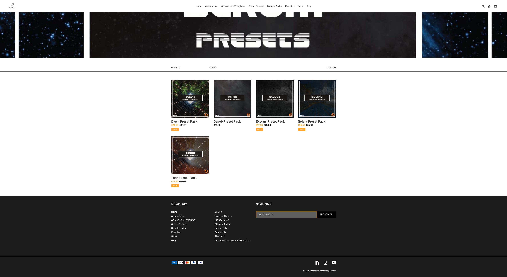

<header id="header">

# Portfolio

A fully responsive portfolio designed by [Fabien Campana](https://github.com/Kobol909/kobol909/blob/81bc7e3ecc4929d48d52f51a7fed65f067d0b885/README.md)  
which showcase my previous works and resume.

<nav>

- [Bio](#bio)
- [Work](#work)
- [Web-Dev](#webdev)
- [About](#about)
- [Contact](#contact)

</nav>

</header>

<article id="bio">

## Bio

My name is Fabien, around here I go by Kobol.  
I am a web developer and tech enthusiast. I currently reside in rainy Paris with my lovely wife.  
My academic education is in Business Management, I studied both in Marseille and abroad - London, Waterloo - Ontario. I have spent my early working years as an electronic music producer (I always enjoy having a conversation about that, so feel free to hit me up) then and I created two e-commerces with my wife, before becoming a web developer. All these experiences account for a large part in what I do, how I do it and who I am in general.  
Aside from the glow of my computer screen, I love soccer, Formula 1 and Mixed Martial Arts. I love listening to audio-books for the last couple of years, and I went through the whole Isaac Asimov Foundation series, Yuval Noah Harari collection, Stephen Hawkins and I just finished the fabulous Bad Blood by John Carreyrou. Lastly, I like beer and coffee.

</article>

<article id="work">

## Work

### From...

At the dawn of the pandemic, my wife and I engaged in the journey of creating an e-commerce. Since I did not know how to write code back then, I decided to use Shopify. It was not the most original design for sure, but it worked well! I learned a lot about SEO and advertising with AdWords or Facebook.

### To:

Slowly but surely my focus shifted towards how I could develop a better version of our websites. So I made the decision to fully commit to learning how to code.  
At the end of my training, I was ready to make the transition from Shopify to the infamous Wordpress (mainly because of SEO issues) and I was able to develop a complete theme from the ground up.  
The technologies I used were:

- The great [Roots.io](https://roots.io/) stack._ PHP._ Laravel Blade.\* Tailwind CSS.</article>

<article id="webdev">

## Web Development training

### Followed Courses:

- [The Complete 2022 Web Development Bootcamp](https://www.udemy.com/course/the-complete-web-development-bootcamp/)
- [The Complete JavaScript Course 2022: From Zero to Expert!](https://www.udemy.com/course/the-complete-javascript-course/)
- [The Complete Node.js Developer Course (3rd Edition)](https://www.udemy.com/course/the-complete-nodejs-developer-course-2/)
- [React - The Complete Guide (incl Hooks, React Router, Redux)](https://www.udemy.com/course/react-the-complete-guide-incl-redux/)
- [2022 Complete Python Bootcamp From Zero to Hero in Python](https://www.udemy.com/course/complete-python-bootcamp/)
- [Python and Django Full Stack Web Developer Bootcamp](https://www.udemy.com/course/python-and-django-full-stack-web-developer-bootcamp/)
- [Web Design for Web Developers: Build Beautiful Websites!](hhttps://www.udemy.com/course/web-design-secrets/)
- [The Complete SQL Bootcamp 2022: Go from Zero to Hero](https://www.udemy.com/course/the-complete-sql-bootcamp/)
- [Java Programming Masterclass covering Java 11 & Java 17](https://www.udemy.com/course/java-the-complete-java-developer-course/)
- [AWS Essentials](https://www.udemy.com/course/aws-essentials-z/)
- [MERN Stack Front To Back: Full Stack React, Redux & Node.js](https://www.udemy.com/course/mern-stack-front-to-back/)
- [Complete Agile Scrum Management + Kanban + 4 EXTRA courses](https://www.udemy.com/course/agile-management-scrum-complete/)
- [API and Web Service](https://www.udemy.com/course/api-and-web-service-introduction/)

### Future courses:

- [Ultimate AWS Certified Developer Associate 2022 - NEW!](https://www.udemy.com/course/aws-certified-developer-associate-dva-c01/)
- [Practice Exams | AWS Certified Developer Associate 2022](https://www.udemy.com/course/aws-certified-developer-associate-practice-tests-dva-c01/)
- [Build Web Apps with Vue JS 3 & Firebase](https://www.udemy.com/course/build-web-apps-with-vuejs-firebase/)
- [Angular - The Complete Guide (2022 Edition)](https://www.udemy.com/course/the-complete-guide-to-angular-2/)

</article>

<article id="about">

## About

I have a profound love for Arts and technologies; over the years I have learned to use software Photoshop, Premiere, Illustrator, Audition, Ableton Live, Logic Pro, Blender 3D, Fusion 360 and the Office Pack . I also learned how to design and 3D print, and how to program and control CNC machines to produce prototypes.  
I have a passion for synthesizers and especially modular ones. This passion also brought me to my first encounter of programming languages - I then learned how to modify the Python script on my midi controllers - it also made me understand OOP programming quite easily later.  
Lastly, I'll add that I am eager to learn new technologies, acquire new competencies and meet new inspiring people.

</article>

<article id="contact">

## Contact

<form method="post" action="#">

<label for="name">Name</label> <input type="text" name="name" id="name">

<label for="email">Email</label> <input type="text" name="email" id="email">

<label for="message">Message</label><textarea name="message" id="message" rows="4"></textarea>

- <input type="submit" value="Send Message" class="primary">
- <input type="reset" value="Reset">

</form>

- [Facebook](https://www.facebook.com/fabiencampana/)
- [Linkedin](https://www.linkedin.com/in/fabien-campana-a01652220)
- [GitHub](https://kobol909.github.io/)

</article>

<footer id="footer">

© 2022 Portfolio designed by: [Fabien Campana](https://kobol909.github.io/).

</footer>

